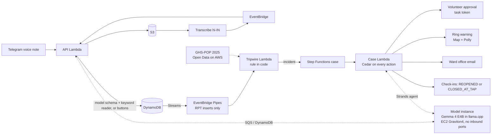
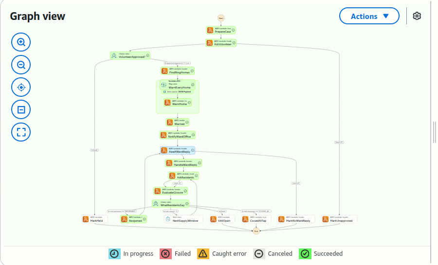

# Teesri Shikayat — the third complaint

**A tripwire for dirty tap water.** When three homes close together report dirty water, everyone around them is warned, and only the residents can close the case.

**Live:** [the console on AWS](https://eirioqqhvtvve3aw5xhpje2wju0jztrl.lambda-url.ap-south-1.on.aws/console) (the recorded demo run: the ring, the warned homes, the ward office's "Resolved" denied, the case reopened) · **Try the bot:** [@TeesriShikayatBot](https://t.me/TeesriShikayatBot?start=B) on Telegram (Hindi)

Built for the WeMakeDevs × AWS **Environmental Hacks** (Heat and Water track), Oct 8–11, 2026. Demo setting: Dongri, B ward, Mumbai. Not affiliated with BMC or any water board.

## The problem

- **Mumbai logged 1,514 contaminated-water complaints from January to August 2026.** On 30 Sep 2026 the BMC Standing Committee asked for a coordinated response with *immediate alerts to residents* ([Free Press Journal, 1 Oct 2026](https://www.freepressjournal.in/mumbai/mumbai-bmc-orders-24x7-action-on-contaminated-water-complaints-after-1514-cases-in-2026)).
- Averages hide pockets: 0.28% of samples were unfit citywide in 2025-26, but **4.03% in B ward (Dongri/Umarkhadi)** (same source). A leaking service line pulls sewage into one lane, not the whole city.
- **Complaints arrive one by one, and nobody connects them.** In Indore's Bhagirathpura (Dec 2025), residents reported discoloured, foul water from mid-December; the first illness came on Dec 27 and over 1,400 people fell ill ([Wikipedia](https://en.wikipedia.org/wiki/2025_Indore_drinking_water_contamination)). A judicial commission examined 36 deaths and linked 24 directly to sewage in the pipeline, as reported by [ETV Bharat](https://www.etvbharat.com/en/bharat/600-page-report-unravels-bhagirathpura-deaths-in-indore-enn26090102772) (the report is not public).

BMC's SOP asks for immediate alerts to residents. Teesri Shikayat does that from the street up, and lets residents confirm when the tap is clean.


*The console in the recorded demo run (simulated homes A–V; a simulated stand-in files the third report). Every enrolled home in the 250 m ring was warned; 20 of 23 never complained.*

## How it works

1. **Join in one tap.** Scan a QR code → Telegram bot → share your location → tap हाँ (consent). No app, no forms. **Try it:** [t.me/TeesriShikayatBot](https://t.me/TeesriShikayatBot?start=B) ([QR](assets/qr-start-B.png)). The bot speaks Hindi; one report gets a receipt, and an alarm needs three neighbours, so a single tester never triggers one. The public console never shows a real home's location unless it is part of an alarm.
2. **Complain the way people do: a Hindi voice note.** Amazon Transcribe (hi-IN) writes it down; an open model we host on AWS (Gemma 4, see below) fills a fixed schema (colour, smell, since when, who is ill); code validates every field, and an illness or a vulnerable person the resident never mentioned is dropped, whatever the model said. A plain-code keyword reader fills anything the model left empty from the Hindi words (पीला, बदबू, दो दिन…), and takes over if the model is off; only if neither can read it does the resident answer three button questions. A failed read never counts as "clean". Typed complaints count too, in Hindi or Roman-script Hinglish ("paani peela hai, badbu aa rahi hai").
3. **The tripwire (code, no AI).** Every new report flows DynamoDB Streams → EventBridge Pipes → a rule: **3 different homes, every pair within 250 m, within 72 h.** If all three are within 30 m (one building, one tank), there's no area alarm; those flats get tank-cleaning advice instead. A report belongs to at most one incident (one DynamoDB transaction), so two simultaneous "third" reports make exactly one incident.
4. **A case per incident (Step Functions).** The case agent briefs a local volunteer in Hindi; one tap approves. Then every enrolled home in the 250 m ring gets a Hindi warning (text + Amazon Polly voice): boil water, ORS, see a doctor, the nearest public hospital. The ward office gets a formal email **with no names or numbers**.
5. **Closed at the tap, not on paper.** When the ward office says "resolved", that is a request to close the case, and Cedar denies it: only residents can close a case. Every home in the ring is asked "पानी साफ़ है?". Any "not clean" reopens the case at once; at least 3 "clean" and no "not clean" closes it; silence never closes it.



## The case on AWS, state by state

Every incident is one **Step Functions Standard** execution, named after the incident; each state is one Lambda call (`infra/stack.py`). Three states wait for people on a **task token**, so a case can wait days for a volunteer, the ward office or the residents, and costs nothing while it waits.


*One execution from the recorded demo run, in the Step Functions console: approved, every home warned, the ward office's "Resolved", a resident's "not clean" → **Reopened**, and the case back in **AwaitWardReply** (blue).*

| State | What happens | Waits for |
|---|---|---|
| PrepareCase | The case agent writes the volunteer's Hindi brief (read-only tools until approval) | |
| AskVolunteer | The volunteer's card: हाँ, भेजें / अभी नहीं | **task token**; no answer in 6 h → MarkUnapproved |
| VolunteerApproved? | "अभी नहीं" → MarkHeld: nothing is sent, the case stays open | |
| FindRingHomes | Every enrolled home within 250 m (a geohash index on the DynamoDB table) | |
| WarnEveryHome | A **Map** state, 10 homes at a time: Hindi text plus one Polly voice note made once per incident; Cedar checks approval, consent and the template for each home | |
| Warned → NotifyWardOffice | The SES email to the ward office: counts only, and Cedar checks the draft for names and numbers | |
| AwaitWardReply | The ward office's reply | **task token**; 14 days → MarkNoWardReply |
| HandleWardReply | "Resolved" is only a request: Cedar lets nobody but the quorum evaluator close a case (in agent mode the agent's `close_case` is denied on the Safety tab) | |
| AskResidents | "पानी साफ़ है?" to every home in the ring | **task token**; a 24 h window |
| EvaluateClosure → WhatResidentsSay | Any "not clean" → **Reopened** → back to AwaitWardReply. At least 3 "clean" and no "not clean" → **ClosedAtTap**. Otherwise **NextSupplyWindow** (a Wait state, 12 h) and ask again, up to 3 rounds → StillOpen | **Wait** |

The timers are a real deployment's; the demo runs a faster clock (30 min, 7 days, 5 min and 60 s, in `src/teesri/workflow.py`). No execution can outlive 30 days.

## AWS services

| Service | Used for |
|---|---|
| **AWS Lambda** (3 functions, Python 3.13, arm64) + a Function URL | The bot's webhook, the console and its API; the tripwire; the case steps. Reserved concurrency as a cost guard |
| **Amazon S3** | Voice notes, transcripts, Polly audio, the model weights |
| **Amazon Transcribe** (hi-IN) | Hindi voice notes to text |
| **Amazon EventBridge** (a rule) | Transcribe's job-state events for our `vn_` jobs wake the same Lambda to finish the report, so nothing polls |
| **Amazon DynamoDB** (one on-demand table) | Homes, reports, incidents and the Safety log. Streams for new reports; a transaction so a report belongs to at most one incident; a geohash index for "homes within 250 m" |
| **Amazon EventBridge Pipes** | The stream → the tripwire, filtered to new reports (`INSERT`, key `RPT#…`); a failed batch is bisected |
| **AWS Step Functions** (Standard) | One execution per incident, above |
| **Amazon Polly** (Kajal, Hindi) | Spoken warnings, receipts and the reopen notice |
| **Amazon SES** | The ward office email (a test inbox in the demo) |
| **Amazon EC2** (Graviton4) + **Amazon SQS** | Our own model (Gemma 4) with no inbound ports: requests arrive on an encrypted queue, answers come back as DynamoDB items, and its IAM role may write only `MODEL#heartbeat` and `MODELRESP#…` items (a `dynamodb:LeadingKeys` condition) |
| **AWS Systems Manager** Parameter Store | The bot token, the webhook secret and the console token |
| **Registry of Open Data on AWS** | GHS-POP population for every ring (`s3://jrc-ghsl`) |
| **AWS CDK** (Python) | The whole stack, one `cdk deploy` (about a minute) |

**Cost:** one real incident (23 homes warned, one reopen) cost **₹0.94 ($0.0107)**, measured from its own Step Functions history and Lambda logs and priced with the AWS Pricing API (`scripts/cost_per_incident.py`). The model instance is extra while it is on ($0.43/h), and it stops itself after an idle hour.

**Proof:** 66 tests (moto, no AWS account needed) cover the tripwire, the ring, the closure rule, the Cedar policies and the public API; `scripts/preflight.py` runs 11 checks against the live stack.

## The model decides language; code decides actions

- The tripwire, the ring, the recipients, the timers and the closure rule are plain code with tests.
- A human volunteer approves every broadcast.
- **Cedar** (`src/teesri/policy.py`) checks every side effect and every agent tool call, and fails closed (missing context or an evaluation error is a DENY). Every decision is logged and shown on the console's Safety tab.

| Policy | Rule |
|---|---|
| only-residents-close | Nobody but the quorum evaluator, with a quorum of residents, can close a case |
| no-pii-to-authority | The ward office email may not contain names or phone numbers (checked in the draft itself) |
| allowlisted-recipients | Messages and email only to enrolled homes and the configured inbox |
| approval-before-broadcast | No warning without the volunteer's approval |
| approved-templates-only | Broadcasts only from fixed, reviewed templates |
| consent-before-message | Only homes that said हाँ are messaged |
| read-only-before-approval | While preparing a case, the agent may only read |


*Agent mode, on our own model: the ward office says "Resolved", the case agent tries `close_case`, Cedar denies it (only residents can close a case), and the agent asks the residents instead.*

**Case agent (Strands).** Three goals: brief the volunteer, write to the ward office, handle the ward office's reply. Numbers in its output come from code; a brief that cites a report that doesn't exist, or adds numbers, is rejected. At most 6 tool calls per goal; any failure falls back to fixed templates.

**The model runs on our own instance.** This AWS account's Bedrock quota is 0 (support case open), so the agent and the voice-note reader use an open model we host ourselves: **Gemma 4 E4B** (Apache-2.0, Google's QAT q4_0 build) in **llama.cpp** on one **EC2 Graviton4** instance (`model/worker.py`). It has **no inbound ports**: requests arrive over SQS and answers come back through DynamoDB, all checked by IAM (`src/teesri/selfhost.py`; Strands talks to it through an httpx transport). The weights are checksum-pinned and kept in S3. It costs $0.43/h while on and stops itself after an idle hour (`scenario.py model on|off`); if it is off, every goal falls back to its template, and the Safety tab says so. Measured on a live run: about 2 s per voice note; per agent goal 3 s (ward reply) to 26 s (ward email), the brief 20 s. Nova on Bedrock plugs into the same code with `MODEL_BACKEND=bedrock`.

## What's real and what's simulated

- **Real:** the Telegram bot, the voice pipeline, the self-hosted model and the case agent, the tripwire, Step Functions, Cedar, Polly, the ring population and map data, and my own phone.
- **Simulated, and labelled on screen:** homes A–V on the phone wall (they use the same code path as a real phone, through a channel adapter), the "+2 days" demo clock, the ward office's reply (a console button), and the ward office inbox (a test inbox).
- **Indore replay:** a labelled reconstruction. Complaint dates are not public, so it assumes three complaints on Dec 15–17.
- **Channel:** Telegram for the demo. WhatsApp plugs into the same adapter (`src/teesri/channel.py`).

## Run it

```bash
python3 -m venv .venv && .venv/bin/pip install -r requirements-dev.txt
.venv/bin/python -m pytest -q                                           # 66 tests, no AWS account needed
./build.sh && AWS_PROFILE=<profile> cdk deploy                          # one stack: Teesri (ap-south-1)
AWS_PROFILE=<profile> .venv/bin/python scripts/set_webhook.py           # point the Telegram bot at the stack
AWS_PROFILE=<profile> .venv/bin/python scripts/scenario.py model on      # start the model instance (stops itself when idle)
AWS_PROFILE=<profile> .venv/bin/python scripts/scenario.py seed          # 22 simulated homes; then open <FunctionUrl>/console
```

Secrets live in SSM Parameter Store (`/teesri/telegram/bot-token`, `/teesri/telegram/webhook-secret`, `/teesri/console-token`), never in code.

## Data

- Population in a warning ring: **GHS-POP R2023A, epoch 2025, 100 m** (European Commission, Joint Research Centre; CC BY 4.0), read from the Registry of Open Data on AWS (`s3://jrc-ghsl/ghs-pop/`) by `scripts/precompute_population.py`. Shown as "~N people"; when the grid doesn't cover a ring it says "NO DATA", never 0.
- Place coordinates and the nearest public hospital: © OpenStreetMap contributors (ODbL).

## Credits

Not ours, used under their licences:

- **Gemma 4 E4B** (Google, Apache-2.0), QAT q4_0 GGUF, run with **llama.cpp** (MIT, official arm64 release build).
- **Strands Agents SDK** (Apache-2.0) and **Cedar** via `cedarpy` (Apache-2.0).
- **Leaflet** (BSD-2-Clause) for the console map; map tiles and place data © OpenStreetMap contributors (ODbL).
- **GHS-POP R2023A** (European Commission JRC, CC BY 4.0), see Data above.
- Video: **Noto Sans / Noto Sans Devanagari** (SIL OFL 1.1); narration voiced with **Chatterbox TTS** (Resemble AI, MIT); music: "Immersed" by **Kevin MacLeod** (incompetech.com), licensed under CC BY 4.0; opening clip (labelled "illustrative footage"): "Tap, Water, Switch Off" by **Kaffeesüchtig** on Pixabay (https://pixabay.com/videos/tap-water-switch-off-close-136086/), Pixabay Content License; sound effects: "Simple Whoosh", "Notification Sound Effect" and "Error Sound" by **DRAGON-STUDIO** on Pixabay, Pixabay Content License.

## Privacy

A home's location is used only after the resident taps हाँ; tapping नहीं deletes what was saved. Reports keep the transcript and a few symptom flags, nothing more. The authority sees counts and anonymised reports, never names or numbers. The public console shows no Telegram ids and rounds real homes to about 100 m.

## AI tools used

This project was built with help from AI coding agents (Claude).
